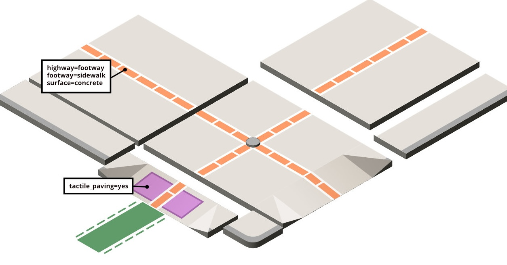

# Kerb Kit for OpenStreetMap (OSM)
Kerb Kit is an open design system for visualizing curbs, crossings, streets, and sidewalk features. It provides pre-made templates and modular design elements that collaborators can use to quickly assemble consistent scenes in vector graphics tools like Inkscape, Affinity Designer, or Adobe Illustrator.

> 
> The Concept: A library of simple tiles for constructing illustrations